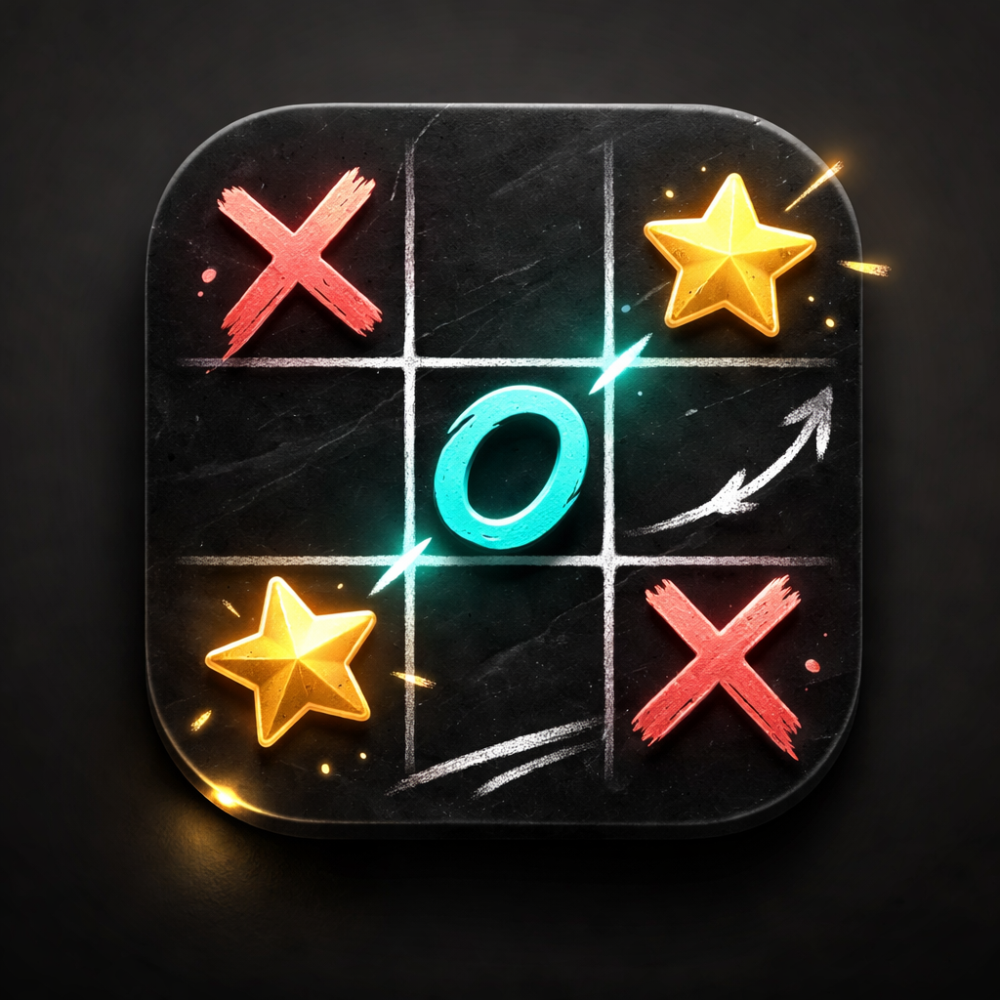

# Batalha da Velha

Batalha da Velha é um jogo divertido de estratégia, onde você enfrenta o computador. Escolha jogar como X ou O e teste sua sorte em partidas rápidas e desafiadoras!

## Funcionalidades

- Jogador vs Computador
- Escolha de jogar como X ou O
- Dois níveis de dificuldade
- Placar de vitórias, empates e derrotas
- Modal para anunciar o vencedor

## Tecnologias

- HTML5
- CSS3
- JavaScript puro

## Como jogar

1. Abra o arquivo `index.html` no navegador.
2. Escolha se quer jogar como X ou O.
3. Clique nas células para marcar seu movimento.
4. O computador fará sua jogada automaticamente.

## Responsividade

O jogo é responsivo e funciona bem em desktop, tablet e celular.

## Licença

Este projeto é livre para uso pessoal e educacional.
